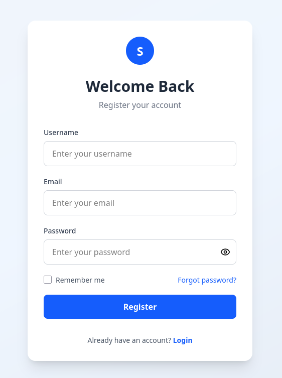
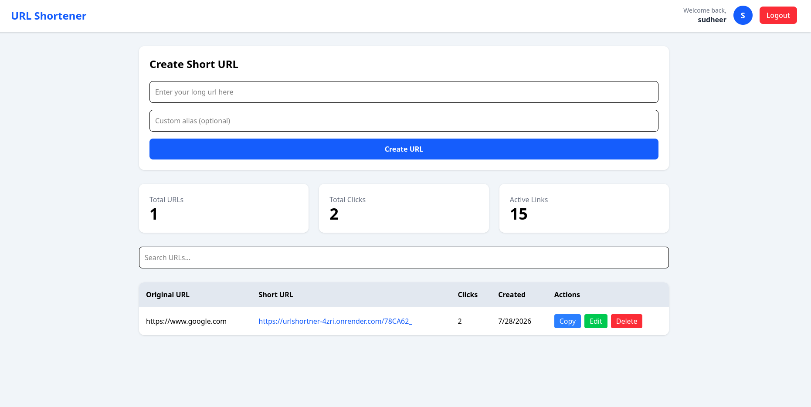

# 🔗 URL Shortener

A full-stack URL Shortener built with the MERN stack that allows users to register, log in, create short URLs, manage them, and track click statistics.

## 🚀 Live Demo

- **Frontend:** https://url-shortner-cyan-six.vercel.app/
- **Backend:** https://urlshortner-4zri.onrender.com

---

## ✨ Features

- 🔐 User Authentication (JWT + HTTP-only Cookies)
- 👤 User Registration & Login
- 🔒 Protected Dashboard
- ✂️ Create Short URLs
- 📋 Copy Short URL to Clipboard
- ✏️ Edit Original URL
- 🗑️ Delete URLs
- 📊 Track Click Count
- 🔍 Search URLs
- 📱 Responsive UI
- 🚀 Redirect Short URL to Original URL

---

## 🛠️ Tech Stack

### Frontend

- React
- React Router
- Axios
- Tailwind CSS
- Vite

### Backend

- Node.js
- Express.js
- MongoDB
- Mongoose
- JWT Authentication
- Cookie Parser
- bcrypt
- nanoid

---

## 📁 Project Structure

```text
urlShortner/
│
├── frontend/
│   ├── src/
│   ├── public/
│   ├── package.json
│   └── vite.config.js
│
├── backend/
│   ├── src/
│   │   ├── config/
│   │   ├── controllers/
│   │   ├── middleware/
│   │   ├── models/
│   │   ├── routes/
│   │   ├── services/
│   │   └── utils/
│   ├── server.js
│   └── package.json
│
└── README.md
```

---

## ⚙️ Installation

### Clone the repository

```bash
git clone https://github.com/your-username/urlShortner.git

cd urlShortner
```

---

## Backend Setup

```bash
cd backend

npm install
```

Create a `.env` file inside `backend`.

```env
PORT=3000

MONGODB_URI=your_mongodb_uri

JWT_SECRET=your_secret_key

CLIENT_URL=http://localhost:5173

NODE_ENV=development
```

Run backend

```bash
npm run dev
```

---

## Frontend Setup

```bash
cd frontend

npm install
```

Create `.env`

```env
VITE_API_URL=http://localhost:3000
```

Run frontend

```bash
npm run dev
```

---

## API Endpoints

### Authentication

| Method | Endpoint | Description |
|---------|----------|-------------|
| POST | `/api/auth/register` | Register User |
| POST | `/api/auth/login` | Login User |
| POST | `/api/auth/logout` | Logout User |
| GET | `/api/auth/me` | Get Logged-in User |

---

### URLs

| Method | Endpoint | Description |
|---------|----------|-------------|
| POST | `/api/urls` | Create Short URL |
| GET | `/api/urls` | Get User URLs |
| PATCH | `/api/urls/:id` | Update URL |
| DELETE | `/api/urls/:id` | Delete URL |
| GET | `/:shortUrl` | Redirect to Original URL |

---

## Screenshots

### Login


---

### Dashboard



---

### Create Short URL



---

## Deployment

### Frontend

- Vercel

### Backend

- Render

### Database

- MongoDB Atlas

---

## Future Improvements

- 📈 Analytics Dashboard
- 📅 URL Expiration
- 📱 QR Code Generation
- 🌐 Custom Domains
- 📊 Charts for Click Analytics
- 🔑 Forgot Password via Email
- 🧪 Unit & Integration Tests
- 🚀 Rate Limiting
- 📝 Custom Short Aliases Validation

---

## Author

**Sudheer Kumar Das**

GitHub: https://github.com/SudheerKumarDas

---

## License

This project is licensed under the MIT License.