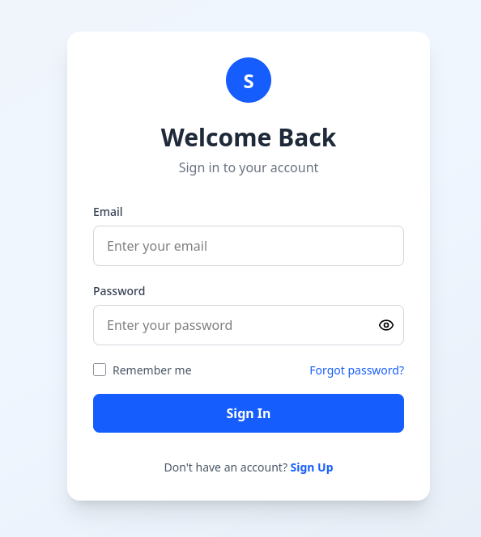
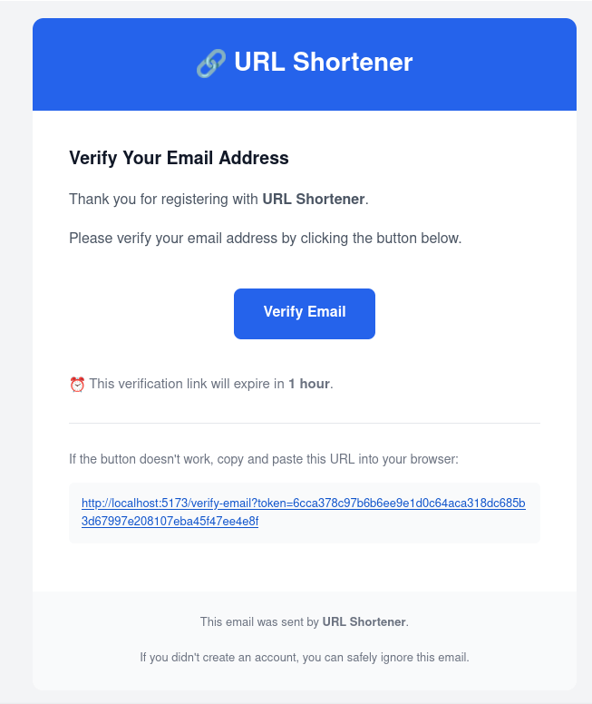

# 🔗 URL Shortener

A modern full-stack URL Shortener built with the MERN Stack. Users can securely register, verify their email, log in, create and manage short URLs, and track click statistics.

---

# 🚀 Live Demo

- **Frontend:** https://url-shortner-cyan-six.vercel.app/
- **Backend:** https://urlshortner-4zri.onrender.com

---

# ✨ Features

## 🔐 Authentication

- User Registration
- Email Verification via Secure Token
- Resend Verification Email
- JWT Authentication
- HTTP-only Cookie Authentication
- Protected Routes
- Secure Logout
- Password Hashing using bcrypt

## 🔗 URL Management

- Create Short URLs
- Redirect Short URL to Original URL
- Update Original URL
- Delete URLs
- Copy Short URL to Clipboard
- Search URLs
- Click Tracking

## 📊 Dashboard

- Total URLs
- Total Clicks
- Active Links
- Responsive Dashboard

---

# 🛠 Tech Stack

## Frontend

- React
- React Router DOM
- Axios
- Tailwind CSS
- React Hot Toast
- Lucide React
- Vite

## Backend

- Node.js
- Express.js
- MongoDB
- Mongoose
- JWT
- Cookie Parser
- bcrypt
- nanoid
- Nodemailer
- Crypto

---

# 📁 Project Structure

```text
urlShortner/
│
├── frontend/
│   ├── public/
│   ├── src/
│   │   ├── components/
│   │   ├── pages/
│   │   ├── routes/
│   │   ├── services/
│   │   └── utils/
│   ├── package.json
│   └── vite.config.js
│
├── backend/
│   ├── src/
│   │   ├── config/
│   │   ├── controllers/
│   │   ├── middleware/
│   │   ├── models/
│   │   ├── routes/
│   │   ├── services/
│   │   └── utils/
│   ├── server.js
│   └── package.json
│
└── README.md
```

---

# ⚙️ Installation

## Clone Repository

```bash
git clone https://github.com/SudheerKumarDas/urlShortner.git

cd urlShortner
```

---

# Backend Setup

```bash
cd backend
npm install
```

Create `.env`

```env
PORT=3000

MONGODB_URI=your_mongodb_uri

JWT_SECRET=your_secret_key

CLIENT_URL=http://localhost:5173

EMAIL_USER=your_email@gmail.com
EMAIL_PASS=your_app_password
EMAIL_PORT=587

NODE_ENV=development
```

Run backend

```bash
npm run dev
```

---

# Frontend Setup

```bash
cd frontend
npm install
```

Create `.env`

```env
VITE_API_URL=http://localhost:3000
```

Run frontend

```bash
npm run dev
```

---

# Authentication Flow

```text
Register
    │
    ▼
Verification Email Sent
    │
    ▼
User Clicks Verification Link
    │
    ▼
Email Verified
    │
    ▼
Login
    │
    ▼
Dashboard
```

---

# API Endpoints

## Authentication

| Method | Endpoint | Description |
|---------|----------|-------------|
| POST | `/api/auth/register` | Register User |
| GET | `/api/auth/verify-email` | Verify Email |
| POST | `/api/auth/resend-verify-email` | Resend Verification Email |
| POST | `/api/auth/login` | Login User |
| POST | `/api/auth/logout` | Logout User |
| GET | `/api/auth/me` | Get Logged-in User |

---

## URL

| Method | Endpoint | Description |
|---------|----------|-------------|
| POST | `/api/urls` | Create URL |
| GET | `/api/urls` | Get All User URLs |
| PATCH | `/api/urls/:id` | Update URL |
| DELETE | `/api/urls/:id` | Delete URL |
| GET | `/:shortUrl` | Redirect to Original URL |

---

# Screenshots

## Register


---

## Login



---

## Email Verification



---

## Dashboard


---

## Deployment

### Frontend

- Vercel

### Backend

- Render

### Database

- MongoDB Atlas

---

# Future Improvements

- Forgot Password
- Password Reset via Email
- QR Code Generation
- URL Expiration
- Custom Short Aliases
- Analytics Charts
- Rate Limiting
- Redis Caching
- Docker Support
- Unit & Integration Testing
- Admin Dashboard
- Custom Domains

---

# Author

**Sudheer Kumar Das**

GitHub: https://github.com/SudheerKumarDas

---

# License

This project is licensed under the MIT License.